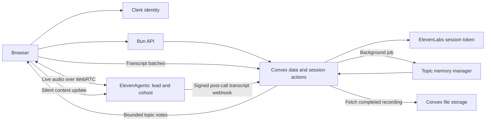

# Podu v4 backend

The app uses Clerk for identity, Convex for durable user data and recordings, Bun for its authenticated HTTP API, and ElevenAgents for the live voice conversation. The three Podu agents have been upgraded through the connected ElevenLabs plugin to `eleven_v4_turbo`, each with one lead voice and a configured `Cohost` voice. Original agent settings are saved in `elevenlabs-v4-rollback.json`.

## What is implemented

- Clerk + Convex React providers; a sign-in screen; verified Clerk JWTs on Bun APIs. Convex derives every user's identity from `ctx.auth`, never a client-supplied user ID.
- Per-user documents, conversation history, transcript viewing, continuation with relevant topic notes, opt-in recording playback, and archive deletion.
- Tokens reserved on the server, with the provider's conversation ID bound before it is returned to the browser. Only configured Podu agents can receive sessions. Starts are limited to 10 in two minutes, and token binding allows one active session per account.
- A single managed WebRTC conversation with XML voice switching, restrained square-bracket audio tags, interruption-enabled introductions, and short responses capped at 350 model tokens. Provider sessions have a 10-minute cap.
- Transcript batches every 2.5 seconds, stable event IDs, retry handling, and correction of interrupted agent responses. The provider's completed transcript replaces tentative browser data. Browser-close delivery is best effort; the webhook is the durable completion path.
- Memory jobs run outside the reply path. Every eight new turns triggers a debounced job. It reads at most 32 turns per pass, retains per-topic summaries and unresolved questions with source sequence references, and rejects stale commits after corrections. Resumption retrieves relevant recent notes and the selected conversation's last six turns.
- During live conversation, changed notes are sent at most every 20 seconds when the agent is listening, using the stable context ID `podu-topic-memory`. This supplies external memory; it does not claim to clear the provider's entire conversation history. Provider-managed context-window compaction is a separate setting.
- HMAC verification on the raw webhook body with a five-minute timestamp tolerance, idempotent completion, authoritative provider duration, recording fetch retries, and a visible recording failure state.
- Browser performance entries named `podu-transcript-to-speech` measure time from receiving a user transcript to the SDK reporting speech. This is not total end-of-speech latency or a production p95 dashboard.

## Model and latency choices

Use v4 Turbo for live sessions. ElevenLabs documents approximately 100 ms median inference latency, excluding app/network latency; ASR, turn detection, LLM generation, transport, and playback still contribute to perceived response time. The existing Gemini Flash/Flash Lite reasoning models are preserved until real latency measurements justify changing them.

The low-level Text to Dialogue socket registers one voice for `eleven_v4_turbo`; full `eleven_v4` accepts multiple voices. Podu uses ElevenAgents' managed multi-voice configuration, which the platform accepted for these three Turbo agents. Configuration acceptance is not a listening test or a promise of simultaneous overlapping speakers. Full-v4 authored episode exports can be a later feature.

Sources: [v4 release](https://elevenlabs.io/v4), [model catalog](https://elevenlabs.io/docs/overview/models), [managed multi-voice](https://elevenlabs.io/docs/eleven-agents/customization/voice/multi-voice-support), [dialogue streaming constraint](https://elevenlabs.io/docs/eleven-api/guides/how-to/websockets/realtime-tdd).

## Setup and remaining live integration

1. Use the existing Clerk application and its `convex` JWT template. The template must have audience `convex`. Set `CLERK_JWT_ISSUER_URL` in the Convex dashboard and Clerk credentials plus `CONVEX_URL` on the Bun host. Set `PODU_ALLOWED_ORIGINS` to the actual frontend origins.
2. Set the same three `ELEVENLABS_AGENT_ID_*` values on Bun and Convex. The development Convex instance has already received these IDs and the new functions/schema.
3. Replace the expired/rejected local `ELEVENLABS_API_KEY` and configure a working key in Convex. Keep the key server-side. The connected ElevenLabs plugin has separate authentication and can edit the agents even when the repo key is invalid.
4. Register a signed `post_call_transcription` webhook in ElevenLabs pointing to `<CONVEX_SITE_URL>/webhooks/elevenlabs`. Put its signing secret in Convex as `ELEVENLABS_WEBHOOK_SECRET`. Keep provider voice recording enabled when replay is wanted. The worker fetches audio from the provider; do not send large base64 audio webhooks to this endpoint.
5. For semantic compaction, set `MEMORY_API_URL`, `MEMORY_API_KEY`, and `MEMORY_MODEL` in Convex. The URL must be an OpenAI-compatible chat-completions endpoint supporting JSON responses. This independently configured model is not called synchronously before a voice response. Without these credentials, Podu uses bounded, attributed transcript excerpts; multi-topic grouping is conservative rather than inferred.
6. Run a signed-in conversation, interrupt both hosts, close the tab, verify the final transcript and saved audio, continue a topic, and check actual latency. Live audio, webhook delivery, and semantic summarization have not been verified while the needed credentials remain unavailable.

`bunx convex dev --once` deploys development functions. `bun run upgrade:agents` prints the versioned profile updates; `--apply` applies them with your local key. `--rollback --apply` restores the saved original settings. `bun run dev:local` explicitly runs the existing SQLite/cookie demo for local testing; it does not persist SaaS history.

## Storage and CDN

Convex database tables store transcript text, topic notes, session metadata, and a file storage ID. Actual audio belongs in Convex **file storage**, not a database document. Convex serves playback URLs, so another CDN is not required to launch. Consider R2/S3 plus a CDN when measured storage/egress costs or long recordings warrant it.

Convex file URLs are bearer URLs: anyone who has one can fetch the recording. Podu checks the owner before returning a URL; that check does not make a shared URL expire. If recordings must be authorized on every byte request or use expiring links, use an authenticated streaming gateway or a storage service with signed URLs. Convex HTTP action responses are limited to 20 MB, while this archive's recording fetch limit is 40 MB. Do not route larger audio through a Convex HTTP response.

Archive deletion removes the Convex session, turns, notes, and stored file. ElevenLabs has its own retention/deletion policy; provider copies are not deleted by that action. The app explains that provider audio processing/retention is separate from opting into saving a Podu replay.

Source: [Convex file serving and access control](https://docs.convex.dev/file-storage/serve-files).

## Before a public launch

The historical billing schema is preserved, but the old unauthenticated billing/usage mutations have not been restored. Add authenticated plan management, signed subscription updates, verified usage accounting, and enforced minute budgets before charging users. Add production latency/error reporting, a retention schedule, provider-copy deletion, and operational alerts for unavailable recordings or failed webhook delivery. Avoid setting model compaction or speculative-response behavior without testing interruptions and context fidelity.

Uploaded documents are now scoped to signed-in users. The local SQLite document library is not automatically assigned to a Clerk account; migrate it only with an explicit owner. The document list is capped at 30, prompt retrieval at 10 documents with 2,400 characters each, topic recall at 12 recent sessions, and transcript reads at 4,000 turns. These bounded starter limits should be replaced by pagination/retrieval policies if real usage exceeds them.
